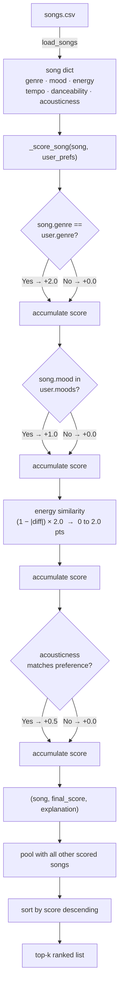
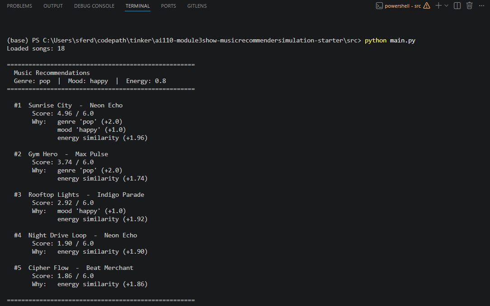

# 🎵 Music Recommender Simulation

## Project Summary

In this project you will build and explain a small music recommender system.

Your goal is to:

- Represent songs and a user "taste profile" as data
- Design a scoring rule that turns that data into recommendations
- Evaluate what your system gets right and wrong
- Reflect on how this mirrors real world AI recommenders

Replace this paragraph with your own summary of what your version does.

---

## How The System Works

### Real-World Context

Major streaming platforms like Spotify and YouTube use two complementary recommendation approaches:

1. **Collaborative Filtering**: Analyzes *other users' behavior* — if thousands of users with similar listening histories loved Song X, you probably will too. Powerful but requires massive datasets and struggles with new users/songs.

2. **Content-Based Filtering**: Analyzes *song attributes* — if you loved an energetic happy song, we recommend other energetic happy songs. Works immediately for new users and handles new content well, but can feel repetitive.

**This simulation focuses on content-based filtering** because it's more transparent, works with small datasets, and teaches the core principles of feature-driven recommendations.

### What The System Prioritizes

The recommender will:
- Match users to songs based on **audio/mood characteristics**, not popularity or trends
- Score each song individually (how similar is it to what you like?)
- Return the top-k highest scoring songs in order

### Song Features

Each `Song` object captures audio and categorical information:

| Feature | Type | Example | Purpose |
|---------|------|---------|---------|
| `id` | int | 1 | Unique identifier |
| `title` | str | "Sunrise City" | Display name |
| `artist` | str | "Neon Echo" | Creator |
| `genre` | str | "pop" | Category grouping |
| `mood` | str | "happy" | Emotional tone (key matching feature) |
| `energy` | float | 0.82 | Intensity level (0.0 to 1.0) |
| `tempo_bpm` | float | 118 | Beats per minute |
| `valence` | float | 0.84 | Musical positivity (0.0 to 1.0) |
| `danceability` | float | 0.79 | How danceable (0.0 to 1.0) |
| `acousticness` | float | 0.18 | Production style (0.0 acoustic, 1.0 electronic) |

### UserProfile Features

Each `UserProfile` stores what the user likes:

| Feature | Type | Example | Purpose |
|---------|------|---------|---------|
| `favorite_genre` | str | "pop" | Preferred music category |
| `favorite_mood` | str | "happy" | Mood they want to hear |
| `target_energy` | float | 0.82 | Preferred intensity level (0.0-1.0) |
| `likes_acoustic` | bool | True | Production preference (acoustic vs electronic) |

### Algorithm Recipe: Point-Based Scoring (6.5 Max)

For each song candidate, the recommender calculates a **match score** on a 6.5-point scale:

```
final_score = genre_points + mood_points + energy_points + tempo_bonus + dance_bonus + acoustic_bonus

Where:
  genre_points = 2.0 if song.genre == user.favorite_genre, else 0.0
  mood_points = 1.0 if song.mood in user.favorite_moods, else 0.0
  energy_points = (1.0 - |user.target_energy - song.energy|) × 2.0  (range: 0.0–2.0)
  tempo_bonus = 0.5 if song.tempo in [user.min_tempo, user.max_tempo], else 0.0
  dance_bonus = 0.5 if song.danceability in [user.min_dance, user.max_dance], else 0.0
  acoustic_bonus = 0.5 if song.acousticness in [user.min_acoustic, user.max_acoustic], else 0.0

Final Score Range: 0.0 to 6.5 points
Interpretation: 6.0+ = Excellent | 4.5–5.9 = Good | 3.0–4.4 = Moderate | <3.0 = Weak
```

**Logic Flow:**
1. Check if genre matches → if yes, +2.0 pts (foundation layer)
2. Check if mood matches → if yes, +1.0 pt (foundation layer)
3. Calculate energy similarity based on distance → 0.0–2.0 pts (ranking layer)
4. Check if secondary features (tempo, danceability, acousticness) are in acceptable ranges → +0.5 each (refinement layer)
5. Sum all components to get final score
6. Rank songs by score descending and return top-k

**Example**: User loves lofi/chill with energy ~0.40

- Song: "Midnight Coding" (lofi, chill, energy 0.42, tempo 78, danceability 0.62, acousticness 0.71)
  - Genre match: 2.0 (lofi = lofi) ✓
  - Mood match: 1.0 (chill in favorites) ✓
  - Energy: (1 - |0.40 - 0.42|) × 2.0 = 1.96 ✓
  - Tempo bonus: 0.5 (78 in range [70, 100]) ✓
  - Dance bonus: 0.5 (0.62 in range [0.40, 0.70]) ✓
  - Acoustic bonus: 0.5 (0.71 in range [0.60, 1.0]) ✓
  - **Score: 5.96 / 6.5 (92%)** → **TOP RECOMMENDATION** 

- Song: "Storm Runner" (rock, intense, energy 0.91, tempo 152, danceability 0.66, acousticness 0.10)
  - Genre match: 0.0 (rock ≠ lofi) ✗
  - Mood match: 0.0 (intense ≠ chill) ✗
  - Energy: (1 - |0.40 - 0.91|) × 2.0 = 0.18 ✗
  - Tempo bonus: 0.0 (152 outside range [70, 100]) ✗
  - Dance bonus: 0.5 (0.66 in range [0.40, 0.70]) ✓
  - Acoustic bonus: 0.0 (0.10 outside range [0.60, 1.0]) ✗
  - **Score: 0.68 / 6.5 (10%)** → **NOT RECOMMENDED** ✗

### Potential Biases and Limitations

This point-based system has known characteristics that may bias recommendations:

| Bias | Description | Impact |
|------|-------------|--------|
| **Genre Gatekeeping** | Genre is weighted heavily (2.0 of 6.5 pts). A user who loves "pop" will almost never see "rock" songs, even if they contain moods/energy the user typically enjoys. | Limits discovery across genre boundaries. May miss cross-genre gems. |
| **Mood Dominance** | If a song's mood doesn't match user preferences, it's hard to recover (starting from 0 vs 3.0). A "happy rock" song won't overcome "rock" genre penalty for a "mellow pop" user. | Reduces serendipitous recommendations. May miss songs that *feel* right despite wrong label. |
| **Energy Neglects Context** | Energy similarity treats all mismatches equally. A user wanting 0.4 energy treats 0.8 (2× too high) the same as 0.0 (4× too low). | May not penalize extreme mismatches enough. A user's "workout" context isn't captured. |
| **Binary Secondary Features** | Tempo/danceability/acousticness use hard range cutoffs (in/out). A song with tempo 99 bpm gets 0.5 bonus; a song at 100 bpm (1 bpm within range) gets full 0.5 bonus. | Songs just outside accepted ranges are unfairly penalized. Discontinuous scoring. |
| **No Popularity or Temporal Context** | All songs scored equally regardless of age, popularity, or context (workout vs study). A 10-year-old deep cut scores the same as a trending hit if features match. | May recommend obscure songs that technically match but aren't culturally relevant right now. |
| **First-Time User Cold Start** | New users with limited preference history will get generic recommendations until history builds. | Early user experience may be poor. |

**Known Workarounds:**
- Add genre similarity (partial credit for related genres like "pop" → "indie pop")
- Add user context ("workout" boosts high energy, "study" boosts low energy)
- Weight popularity slightly (+0.1 bonus for trending songs)
- Normalize range bonuses to use similarity instead of hard cutoffs

### Recommendation Process



## Getting Started

### Setup

1. Create a virtual environment (optional but recommended):

   ```bash
   python -m venv .venv
   source .venv/bin/activate      # Mac or Linux
   .venv\Scripts\activate         # Windows

2. Install dependencies

```bash
pip install -r requirements.txt
```

3. Run the app:

```bash
python -m src.main
```

**Expected output:**



### Running Tests

Run the starter tests with:

```bash
pytest
```

You can add more tests in `tests/test_recommender.py`.

---

## Experiments You Tried

Use this section to document the experiments you ran. For example:

- What happened when you changed the weight on genre from 2.0 to 0.5
- What happened when you added tempo or valence to the score
- How did your system behave for different types of users

---

## Limitations and Risks

Summarize some limitations of your recommender.

Examples:

- It only works on a tiny catalog
- It does not understand lyrics or language
- It might over favor one genre or mood

You will go deeper on this in your model card.

---

## Reflection

Read and complete `model_card.md`:

[**Model Card**](model_card.md)

Write 1 to 2 paragraphs here about what you learned:

- about how recommenders turn data into predictions
- about where bias or unfairness could show up in systems like this


